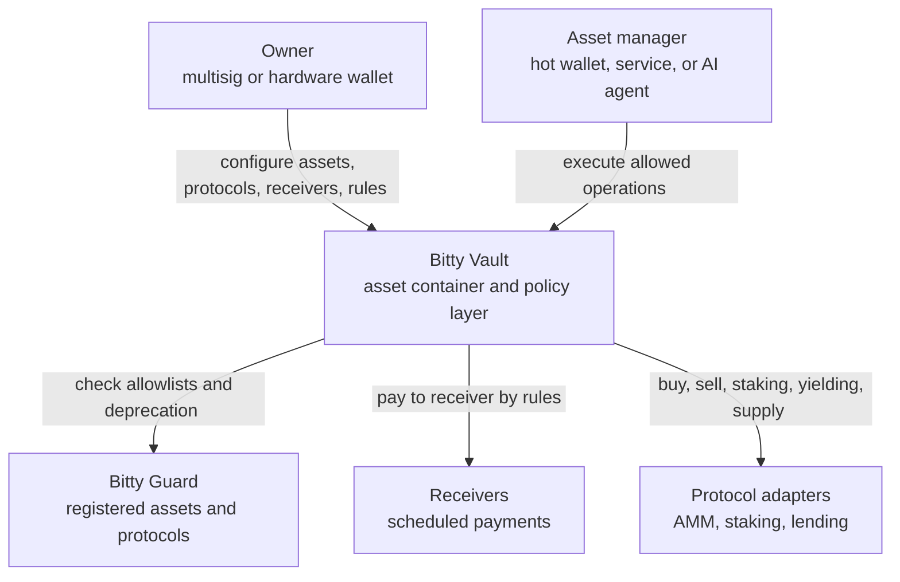

# Bitty Vault Contracts [](https://codecov.io/gh/BittyIO/vault)

Bitty Vault separates a wallet into three roles — Owner, Asset Manager, and Receiver. [BittyGuard](https://github.com/BittyIO/guard) protects users' funds from scams by allowing them to touch only whitelisted assets and protocols.

Each user creates their own vault, choosing assets and protocols from the [Bitty Protocol Store](https://github.com/BittyIO/protocol-store). Asset managers — whether AI agents or humans — can then execute DeFi operations safely, without risk of protocol frontend supply-chain attacks or the vault being drained.



### Risk over time

Where signing and UI risk is live — not just who holds the keys.

```
  EOA: risk from wallet to DeFi website, every time
  ──────────────────────────────────────────────────

  risk ████████████████████████████████████████████████████████████████
       wallet ──► connect ──► review tx ──► sign ──► DeFi frontend
       (entire path, every session; one bad signature = total loss)


  Safe Multi-sig: risk from the Safe website, every time
  ──────────────────────────────────────────────────────

  risk ████████████████████████████████████████████████████████████████
       open Safe UI ──► build tx ──► M signers review ──► execute
       (every approval; compromised UI or bad calldata can still drain funds)


  Bitty Vault: risk only at owner settings
  ────────────────────────────────────────

  risk ████████
       owner configures policy (allowlist, limits, roles)
       │
       └──► routine execution ───────────────────────────────────────►
            ░░░░░░░░░░░░░░░░░░░░░░░░░░░░░░░░░░░░░░░░░░░░░░░░░░░░░░░░░░
            asset manager operates within guard rules — no owner-key
            exposure on each trade, rebalance, or scheduled payment
```

EOA and Safe carry frontend and signing risk on **every** interaction. Bitty Vault concentrates that risk into **owner configuration** — the moments when policy changes. Day-to-day execution runs under onchain guard checks, so a compromised DeFi frontend cannot override what the owner already locked in.

## Prerequisites

- [Foundry](https://book.getfoundry.sh/getting-started/installation)
- Git with submodule support

## Setup

Clone the repository and initialize all dependencies as git submodules:

```shell
git clone --recurse-submodules https://github.com/bittyio/vault.git
cd vault
```

If you already cloned without submodules:

```shell
git submodule update --init --recursive
```

Copy the sample environment file and fill in your keys:

```shell
cp .env.sample .env
```

| Variable | Purpose |
| --- | --- |
| `ALCHEMY_KEY` | RPC access for fork tests and scripted deployments |
| `ETHERSCAN_API_KEY` | Contract verification on Etherscan |

Foundry reads `.env` automatically for `${ALCHEMY_KEY}` and `${ETHERSCAN_API_KEY}` in `foundry.toml`.

## Build

```shell
forge build
```

## Test

Run all tests:

```shell
forge test -vvv
```

Local tests only (BittyV1VaultFactory and BittyV1Vault; no RPC required):

```shell
forge test -vvv --no-match-path 'test/fork/*'
```

Coverage report:

```shell
forge coverage --ir-minimum --no-match-coverage 'test|node_modules|script|src/libs'
```

## Deploy

Deployment scripts read chain-specific addresses from `deployments/<chain>.toml` via `forge-std` config. Deploy in order — each step writes addresses the next step needs.

### Step 1 — Deploy logic libraries

Deploy `VaultLogic` and `ManagerLogic` via the canonical CREATE2 deployer (`0x4e59b44847b379578588920cA78FbF26c0B4956C`, salt `0x0`). Both live in `script/LogicLibraries.s.sol` and must be broadcast separately.

**1a — Deploy VaultLogic** (no `--libraries` flag):

```shell
source .env
forge script script/LogicLibraries.s.sol:VaultLogic \
  --rpc-url sepolia \
  --broadcast \
  --private-key $SEPOLIA_PRIVATE_KEY \
  -vvvv
```

**1b — Deploy ManagerLogic** (links against VaultLogic at `{vaultLogicAddress}`):

```shell
forge script script/LogicLibraries.s.sol:ManagerLogic \
  --rpc-url sepolia \
  --broadcast \
  --private-key $SEPOLIA_PRIVATE_KEY \
  -vvvv
```

Writes `VAULT_LOGIC` and `MANAGER_LOGIC` to `deployments/<chain>.toml`.

### Step 2 — Deploy Bitty Vault implementation

Deploy `BittyV1Vault` via CREATE2. Pass both library addresses from step 1:

```shell
forge script script/BittyV1Vault.s.sol:BittyV1Vault \
  --rpc-url sepolia \
  --broadcast \
  --private-key $SEPOLIA_PRIVATE_KEY \
  -vvvv
```

Writes `VAULT_IMPLEMENTATION` to `deployments/<chain>.toml`.

### Step 3 — Deploy Bitty Vault Factory

Deploy `BittyV1VaultFactory` via the immutable factory at `0x0000000000FFe8B47B3e2130213B802212439497`, initialized with `VAULT_IMPLEMENTATION`, `BITTY_GUARD`, and `WETH` from the chain TOML:

```shell
forge script script/BittyV1VaultFactory.s.sol:BittyV1VaultFactory \
  --rpc-url sepolia \
  --broadcast \
  --private-key $SEPOLIA_PRIVATE_KEY \
  -vvvv
```

Writes `BITTY_VAULT_FACTORY` to `deployments/<chain>.toml`.

Each script is idempotent — contracts already present at their expected address are skipped.

## Verify

### Verify logic libraries

`ManagerLogic` links against `VaultLogic`, so pass its deployed address via `--libraries`:

```shell
forge verify-contract \
  --chain sepolia \
  {vaultLogicAddress} \
  src/logic/VaultLogic.sol:VaultLogic \
  --etherscan-api-key $ETHERSCAN_API_KEY

forge verify-contract \
  --chain sepolia \
  {assetManagerLogicAddress} \
  src/logic/ManagerLogic.sol:ManagerLogic \
  --libraries src/logic/VaultLogic.sol:VaultLogic:{vaultLogicAddress} \
  --etherscan-api-key $ETHERSCAN_API_KEY
```

### Verify Bitty Vault implementation

`BittyV1Vault` links against both logic libraries, so pass both deployed addresses via `--libraries`:

```shell
forge verify-contract \
  --chain sepolia \
  {VaultImplementationAddress} \
  src/BittyV1Vault.sol:BittyV1Vault \
  --libraries src/logic/VaultLogic.sol:VaultLogic:{vaultLogicAddress} \
  --libraries src/logic/ManagerLogic.sol:ManagerLogic:{ManagerLogicAddress} \
  --etherscan-api-key $ETHERSCAN_API_KEY
```

`VaultImplementationAddress` is the `VAULT_IMPLEMENTATION` value recorded in `deployments/<chain>.toml`.

### Verify Bitty Vault Factory

```shell
forge verify-contract \
  --chain sepolia \
  <factory-address> \
  src/BittyV1VaultFactory.sol:BittyV1VaultFactory \
  --etherscan-api-key $ETHERSCAN_API_KEY
```

## Formatting

```shell
forge fmt
forge fmt --check   # CI uses this
```

## License

AGPL-3.0-only
