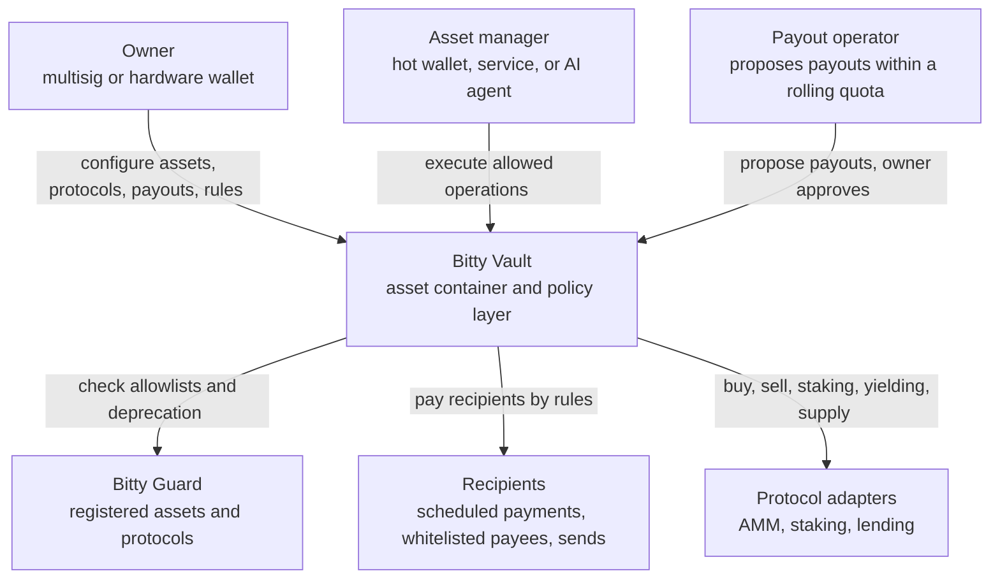

# Bitty Vault Contracts [](https://codecov.io/gh/BittyIO/vault)

Bitty Vault separates a wallet into three roles — Owner, Asset Manager, and Payout Operator. [BittyGuard](https://github.com/BittyIO/guard) protects users' funds from scams by allowing them to touch only whitelisted assets and protocols.

Each user creates their own vault, choosing assets and protocols from the [Bitty Protocol Store](https://github.com/BittyIO/protocol-store). Asset managers — whether AI agents or humans — can then execute DeFi operations safely, without risk of protocol frontend supply-chain attacks or the vault being drained.


```mermaid
flowchart TB
    Owner["Owner<br/>multisig or hardware wallet"]
    AssetManager["Asset manager<br/>hot wallet, service, or AI agent"]
    PayoutOperator["Payout operator<br/>proposes payouts within a rolling quota"]
    Vault["Bitty Vault<br/>asset container and policy layer"]
    Guard["Bitty Guard<br/>registered assets and protocols"]
    Recipients["Recipients<br/>scheduled payments, whitelisted payees, sends"]
    Protocols["Protocol adapters<br/>AMM, staking, lending"]

    Owner -->|"&nbsp;configure assets, protocols, payouts, rules&nbsp;"| Vault
    AssetManager -->|"&nbsp;execute allowed operations&nbsp;"| Vault
    PayoutOperator -->|"&nbsp;propose payouts, owner approves&nbsp;"| Vault
    Vault -->|"&nbsp;check allowlists and deprecation&nbsp;"| Guard
    Vault -->|"&nbsp;pay recipients by rules&nbsp;"| Recipients
    Vault -->|"&nbsp;buy, sell, staking, yielding, supply&nbsp;"| Protocols
```

### Risk over time

Where signing and UI risk is live — not just who holds the keys.

```
  EOA: risk from wallet to DeFi website, every time
  ──────────────────────────────────────────────────

  risk ████████████████████████████████████████████████████████████████
       wallet ──► connect ──► review tx ──► sign ──► DeFi frontend
       (entire path, every session; one bad signature = total loss)


  Safe Multi-sig: risk from the Safe website, every time
  ──────────────────────────────────────────────────────

  risk ████████████████████████████████████████████████████████████████
       open Safe UI ──► build tx ──► M signers review ──► execute
       (every approval; compromised UI or bad calldata can still drain funds)


  Bitty Vault: risk only at owner settings
  ────────────────────────────────────────

  risk ████████
       owner configures policy (allowlist, limits, roles)
       │
       └──► routine execution ───────────────────────────────────────►
            ░░░░░░░░░░░░░░░░░░░░░░░░░░░░░░░░░░░░░░░░░░░░░░░░░░░░░░░░░░
            asset manager operates within guard rules — no owner-key
            exposure on each trade, rebalance, or scheduled payment
```

EOA and Safe carry frontend and signing risk on **every** interaction. Bitty Vault concentrates that risk into **owner configuration** — the moments when policy changes. Day-to-day execution runs under onchain guard checks, so a compromised DeFi frontend cannot override what the owner already locked in.

## What protection costs

The security above is not free — but it is cheap. Because funds never leave the vault and every action is checked against the guard, a compromised DeFi frontend, a malicious relayer, or a leaked asset-manager key **cannot drain your money**. The price of that immunity is a little extra gas on each operation: instead of hitting the protocol directly, every call routes through the vault and its guard. The path is

```
asset manager ─► Vault (CALL) ─► DeFi facet (delegatecall) ─► AssetManagerLogic (delegatecall)
                                     │
                                     ├─► Guard (staticcall: is protocol deprecated?)
                                     └─► per-vault protocol clone (CALL ─► minimal-proxy delegatecall) ─► real protocol
```

Two things add gas versus a direct call:

1. **Dispatch plumbing** — ~4–5 extra cross-contract hops (fallback delegatecall, library delegatecall, guard staticcall, clone call, proxy delegatecall). About **12–20k gas, fixed**, the same for every protocol.
2. **Token custody** — funds live in the vault but the clone executes, so each operation routes the input token `vault → clone → protocol` and the receipt/output token back `protocol → clone → vault`: typically **2 extra ERC-20 transfers per operation** (~25–50k each). This is the dominant cost.

Estimated extra gas per operation (derived from the call graph and standard mainnet opcode/ERC-20 costs, not a live benchmark). USD assumes **ETH = $1,900**:

| Protocol | Operation | Extra gas vs. direct | @ ~0.045 gwei (now) | @ 3 gwei (normal) |
| --- | --- | --- | --- | --- |
| Uniswap V3 | market sell / buy | ~85k | $0.007 | $0.48 |
| Aave V3 | supply / withdraw | ~95k | $0.008 | $0.54 |
| Lido | stake | ~82k | $0.007 | $0.47 |
| Sky (sUSDS) | stake / unstake | ~75k | $0.006 | $0.43 |
| CoW Swap | place limit / TWAP order | ~110k | $0.009 | $0.62 |

Fractions of a cent today, and well under a dollar even at normal gas — the cost of a single trade. Weigh that against the alternative: with an EOA or a Safe, one bad signature on a compromised frontend can take **everything**. A few cents of gas per operation is what it costs to make that impossible.

## Development

Build, test, deploy, and verify instructions live in [dev.md](./dev.md).

## License

AGPL-3.0-only
