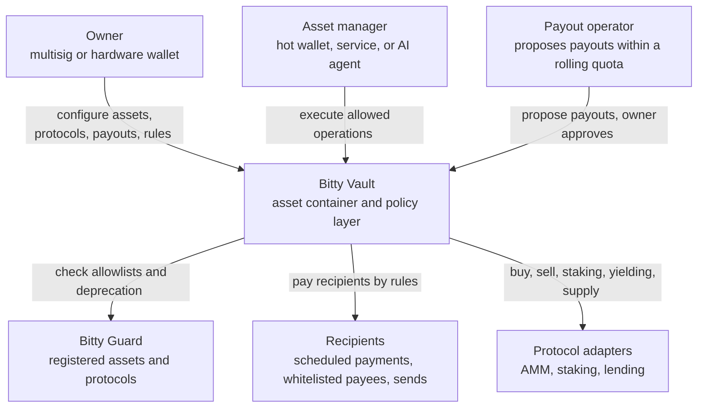

# Bitty Vault Contracts [](https://codecov.io/gh/BittyIO/vault)

Bitty Vault separates a wallet into three roles — Owner, Asset Manager, and Payout Operator. [BittyGuard](https://github.com/BittyIO/guard) protects users' funds from scams by allowing them to touch only whitelisted assets and protocols.

Each user creates their own vault, choosing assets and protocols from the [Bitty Protocol Store](https://github.com/BittyIO/protocol-store). Asset managers — whether AI agents or humans — can then execute DeFi operations safely, without risk of protocol frontend supply-chain attacks or the vault being drained.


```mermaid
flowchart TB
    Owner["Owner<br/>multisig or hardware wallet"]
    AssetManager["Asset manager<br/>hot wallet, service, or AI agent"]
    PayoutOperator["Payout operator<br/>proposes payouts within a rolling quota"]
    Vault["Bitty Vault<br/>asset container and policy layer"]
    Guard["Bitty Guard<br/>registered assets and protocols"]
    Recipients["Recipients<br/>scheduled payments, whitelisted payees, sends"]
    Protocols["Protocol adapters<br/>AMM, staking, lending"]

    Owner -->|"&nbsp;configure assets, protocols, payouts, rules&nbsp;"| Vault
    AssetManager -->|"&nbsp;execute allowed operations&nbsp;"| Vault
    PayoutOperator -->|"&nbsp;propose payouts, owner approves&nbsp;"| Vault
    Vault -->|"&nbsp;check allowlists and deprecation&nbsp;"| Guard
    Vault -->|"&nbsp;pay recipients by rules&nbsp;"| Recipients
    Vault -->|"&nbsp;buy, sell, staking, yielding, supply&nbsp;"| Protocols
```

### Risk over time

Where signing and UI risk is live — not just who holds the keys.

```
  EOA: risk from wallet to DeFi website, every time
  ──────────────────────────────────────────────────

  risk ████████████████████████████████████████████████████████████████
       wallet ──► connect ──► review tx ──► sign ──► DeFi frontend
       (entire path, every session; one bad signature = total loss)


  Safe Multi-sig: risk from the Safe website, every time
  ──────────────────────────────────────────────────────

  risk ████████████████████████████████████████████████████████████████
       open Safe UI ──► build tx ──► M signers review ──► execute
       (every approval; compromised UI or bad calldata can still drain funds)


  Bitty Vault: risk only at owner settings
  ────────────────────────────────────────

  risk ████████
       owner configures policy (allowlist, limits, roles)
       │
       └──► routine execution ───────────────────────────────────────►
            ░░░░░░░░░░░░░░░░░░░░░░░░░░░░░░░░░░░░░░░░░░░░░░░░░░░░░░░░░░
            asset manager operates within guard rules — no owner-key
            exposure on each trade, rebalance, or scheduled payment
```

EOA and Safe carry frontend and signing risk on **every** interaction. Bitty Vault concentrates that risk into **owner configuration** — the moments when policy changes. Day-to-day execution runs under onchain guard checks, so a compromised DeFi frontend cannot override what the owner already locked in.

## Development

Build, test, deploy, and verify instructions live in [dev.md](./dev.md).

## License

AGPL-3.0-only
